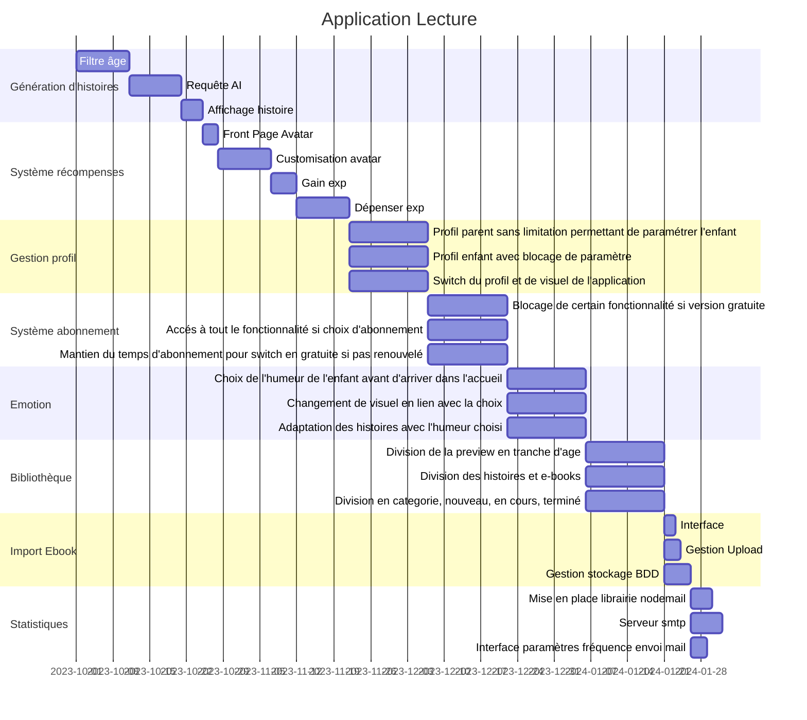

```mermaid
gantt
    title Application Lecture
    
    section Génération d'histoires
    Filtre âge : a1, 2023-10-01, 10d
    Requête AI : a2, after a1, 10d
    Affichage histoire : a3, after a2, 4d

    section Système récompenses
    Front Page Avatar : b1, after a3  , 3d
    Customisation avatar : b2, after b1, 10d
    Gain exp : b3, after b2, 5d
    Dépenser exp : b4, after b3, 10d

    section Gestion profil
    Profil parent sans limitation permettant de paramétrer l'enfant : c1, after b4, 15d
    Profil enfant avec blocage de paramètre : c2, after b4, 15d
    Switch du profil et de visuel de l'application : c3, after b4, 15d

    section Système abonnement
    Blocage de certain fonctionnalité si version gratuite : d1, after c3, 15d
    Accés à tout le fonctionnalité si choix d'abonnement : d2, after c3, 15d
    Mantien du temps d'abonnement pour switch en gratuite si pas renouvelé : d3, after c3, 15d

    section Emotion 
    Choix de l'humeur de l'enfant avant d'arriver dans l'accueil : e1, after d3, 15d
    Changement de visuel en lien avec la choix : e2, after d3, 15d
    Adaptation des histoires avec l'humeur choisi : e3, after d3, 15d

    section Bibliothèque
    Division de la preview en tranche d'age : f1, after e3, 15d
    Division des histoires et e-books : f2, after e3, 15d
    Division en categorie, nouveau, en cours, terminé : f3, after e3, 15d

    section Import Ebook
    Interface: g1, after f3, 2d
    Gestion Upload: g2, after f3, 3d
    Gestion stockage BDD : g3, after f3, 5d

    section Statistiques
    Mise en place librairie nodemail: h1, after g3, 4d
    Serveur smtp: h2, after g3, 6d
    Interface paramètres fréquence envoi mail: h3, after g3, 3d
```