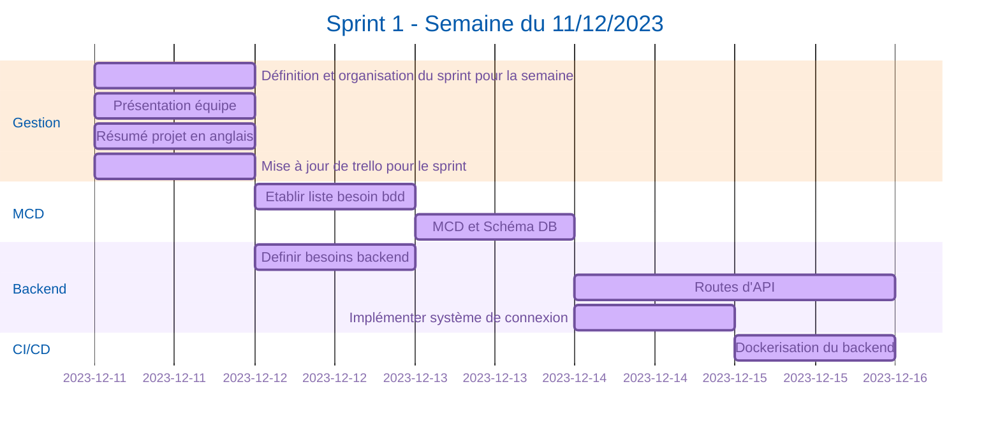
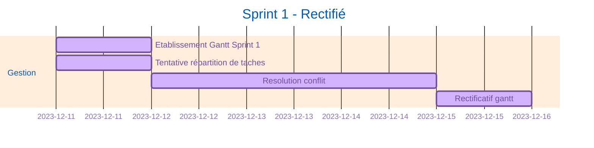

```mermaid
%%{
  init: {
    'theme': 'base',
    'themeVariables': {
      'primaryColor': '#D2B3FC',
      'primaryTextColor': '#252525',
      'primaryBorderColor': '#70509D',
      'lineColor': '#E38833',
      'secondaryColor': '#252525',
      'tertiaryColor': '#FAA453',
      'textColor': '#70509D'
    }
  }
}%%

    gantt
    title Sprint 1 - Semaine du 11/12/2023
    dateFormat  YYYY-MM-DD
    section Gestion
    Définition et organisation du sprint pour la semaine :a1, 2023-12-11, 1d
    Présentation équipe     :a2, 2023-12-11, 1d
    Résumé projet en anglais    :a3, 2023-12-11, 1d
    Mise à jour de trello pour le sprint    :a4, 2023-12-11, 1d
    
    section MCD
    Etablir liste besoin bdd    :b1, 2023-12-12, 1d
    MCD et Schéma DB :b2, 2023-12-13, 1d

    section Backend
    Definir besoins backend :c1, 2023-12-12, 1d
    Routes d'API    :c2, 2023-12-14, 2d
    Implémenter système de connexion    :c3, 2023-12-14, 1d

    section CI/CD
    Dockerisation du backend    :d1, 2023-12-15, 1d 
```

```mermaid
%%{
  init: {
    'theme': 'base',
    'themeVariables': {
      'primaryColor': '#D2B3FC',
      'primaryTextColor': '#252525',
      'primaryBorderColor': '#70509D',
      'lineColor': '#E38833',
      'secondaryColor': '#252525',
      'tertiaryColor': '#FAA453',
      'textColor': '#70509D'
    }
  }
}%%

    gantt
      title Sprint 1 - Rectifié
      dateFormat YYYY-MM-DD
      section Gestion
      Etablissement Gantt Sprint 1  :a1, 2023-12-11, 1d
      Tentative répartition de taches :a2, 2023-12-11, 1d
      Resolution conflit  :a3, 2023-12-12, 3d
      Rectificatif gantt :a4, 2023-12-15, 1d
```