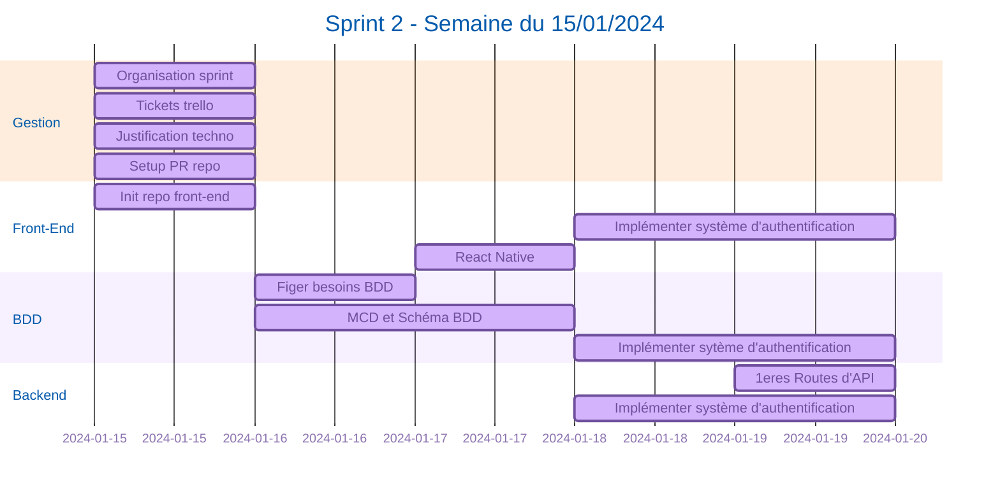

```mermaid
%%{
  init: {
    'theme': 'base',
    'themeVariables': {
      'primaryColor': '#D2B3FC',
      'primaryTextColor': '#252525',
      'primaryBorderColor': '#70509D',
      'lineColor': '#E38833',
      'secondaryColor': '#252525',
      'tertiaryColor': '#FAA453',
      'textColor': '#70509D'
    }
  }
}%%

    gantt
    title Sprint 2 - Semaine du 15/01/2024
    dateFormat  YYYY-MM-DD
    section Gestion
    Organisation sprint :a1, 2024-01-15, 1d
    Tickets trello    :a2, 2024-01-15, 1d
    Justification techno  :a3, 2024-01-15, 1d
    Setup PR repo :a4, 2024-01-15, 1d
    
    section Front-End
    Init repo front-end :b1, 2024-01-15, 1d
    Implémenter système d'authentification  :b2, 2024-01-18, 2d
    React Native :b3, 2024-01-17, 1d

    section BDD
    Figer besoins BDD    :c1, 2024-01-16, 1d
    MCD et Schéma BDD :c2, 2024-01-16, 2d
    Implémenter sytème d'authentification :c3, 2024-01-18, 2d

    section Backend
    1eres Routes d'API    :d2, 2024-01-19, 1d
    Implémenter système d'authentification    :d3, 2024-01-18, 2d 
```