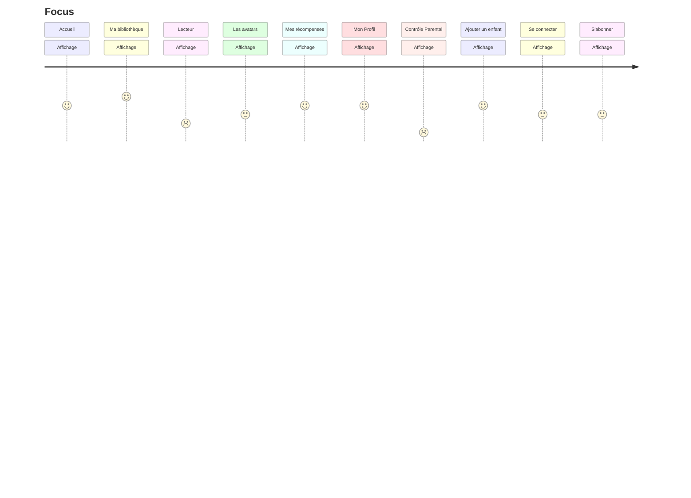
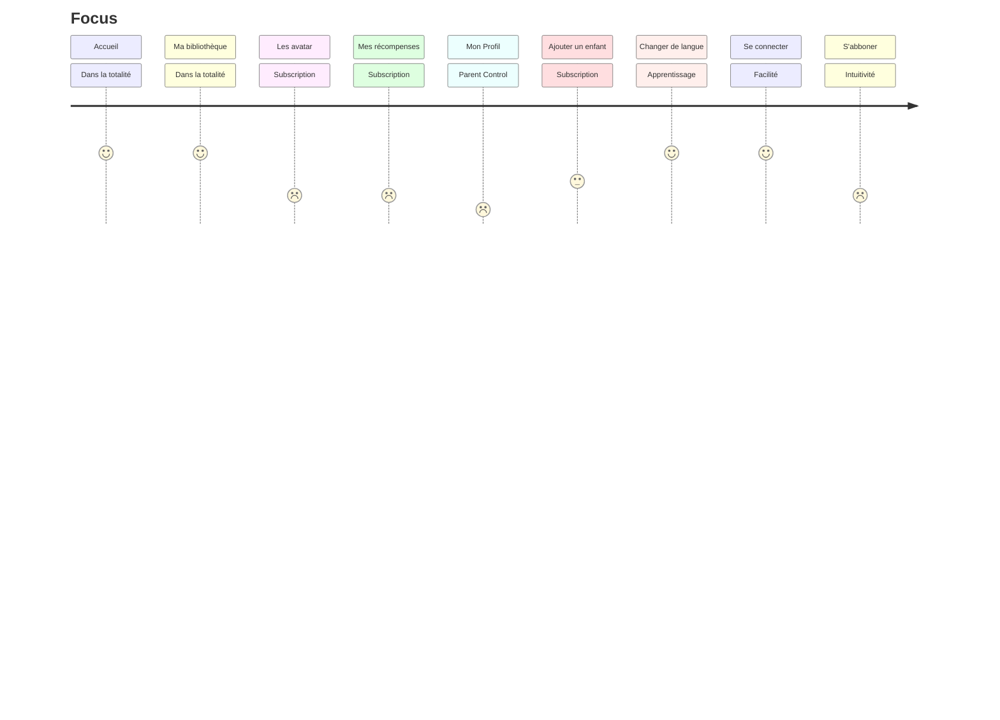
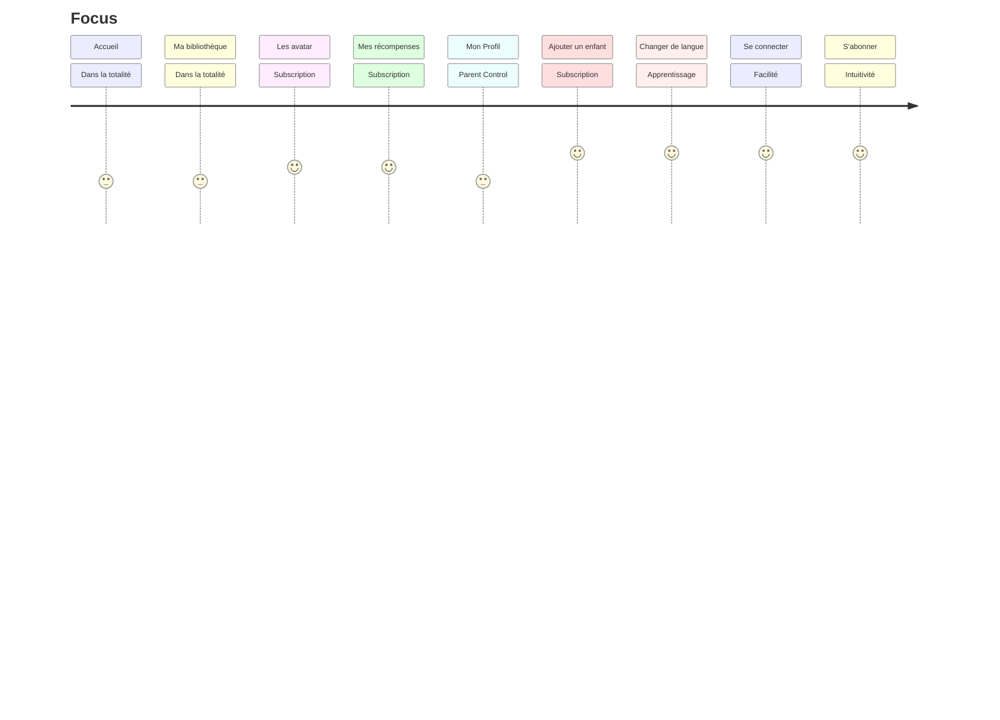

# Interview Alix

## Points soulevés
- Alix fait directement remarquer un problème dans l'utilisation autonome et le système d'abonnement. Implication des parents important pour lui.
- Proposition d'ajout dans le lecteur d la possibilité de modifier les couleurs de fond (les fonds colorés aident les enfants dyslexiques). Et propose des polices sans empatements : Arial ou Cambria en 14 avec interligne fort.
=> penser à ajouter beaucoup de paramètres modifiables au lecteur d'histoires.
- Proposition à la fin de l'histoire que l'enfant réponde à une question assez générique: "Que penses-tu que le héros/l'héroïne ressent à la fin de l'histoire?" etc.
- Proposition d'une notification paramètrable fait aux parents pour les notifier régulièrement de l'avancée de la lecture de l'enfant, du nombres d'histoires afin qu'ils ou elles puissent engager une discussion avec l'enfant.
- Proposition d'un mode exercice en mode texte à trou qui permettrait de conjuguer un mot ou selection choix multiples vocabulaire adapté.
- Proposition d'ajouter une fonctionnalité d'impression de l'histoire qui plaît l'enfant (lien affilié avec un imprimeur à la demande?)

## User Journey

# Interview Antonietta

## Points soulevés

Antonietta souligne qu'il pourrait être plus intéressant pour un enfant de pouvoir tester la personnalisation des avatars avant de pouvoir demander au parent de s'abonner, sinon il risque de se désintéresser de l'application.
De même, il souligne que le fait de pouvoir avoir un aperçu des récompenses pouvant être échangées contre des points d'expérience pourrait augmenter l'intérêt des utilisateurs.
Il nous dit également de permettre au parent d'ajouter au moins un profil enfant pour lui permettre d'explorer l'application avant d'acheter, mais en bloquant le choix des préférences pour générer des histoires cohérentes avec les préférences de l'enfant.
Elle trouve que l'application n'est pas très intuitive sur certains points pour un jeune public, elle recommande d'ajouter des boutons qui permettent de revenir en arrière facilement.
Il nous fait part de sa crainte qu'un enfant puisse acheter l'application de manière autonome s'il connaît le code du téléphone et donc appliquer le contrôle parental.

Par rapport à cela:
- Nous avons modifié notre wireframe permettant à l'utilisateur de tester la personnalisation des avatars, en laissant certaines personnalisations libres et en lui demandant de s'abonner uniquement lorsqu'il souhaite choisir des skins ou accessoires bloqués par l'abonnement.
- De la même manière, nous avons rendu visible la page des récompenses, donnant un aperçu de la façon dont l'utilisateur pourrais échanger ces points d'expérience en choisissant de générer de nouvelles histoires à son guise.
- Nous avons inclus des boutons de retour à l'accueil, pour qu'il soit plus intuitif pour un enfant de pouvoir revenir en arrière, plutôt que de glisser vers la gauche.
- Nous essayons de comprendre comment intégrer un contrôle parental, pour éviter que l'enfant ne démarre l'abonnement à l'insu des parents.

## User Journey

# Interview Leslie

## Points soulevés

- Problème de compréhension à l'accueil avec "Mes Histoires". Elle ne voit pas à quoi cela renvoie.
=> modifier "Mes histoires" par quelque chose comme "Mes histoires prsonnalisées" pour les différencier des e-books.
- Soulève un problème de manque de clarté dans le choix de la tranche d'âge. Elle pense qu'il faut que ce soit au départ. Nécessité de controler que ce qui va être lu à l'enfant est en accord avec a tranche d'âge (elle cite par exemple la différence entre Spiderman et Spidy. Spiderman est pour les enfants mais abordent des thèmes qui peuvent être compliqués comme la perte des parents. Des thèmes qui sont pas dans Spidy qui est plus adaptés aux enfants plus petits.).
- Point positif d'avoir plusieurs langues notamment pour les couples bi nationaux.
=> le mettre plus en avant ?
- Reflechir à la gamification. Peut-être moins intéressant pour certains parents ou au contaire les interesser à utiliser l'appli pour son enfant. Leslie parle d'un système de badge.
=> Réflechir à des choses qui récompensent les parents ?
- Elle soulève un point concernant la personnalisation de l'avatar : la personnalisation de l'humeur. Beaucoup de discussion sur les réseaux par rapport à la gestion et la connaissance de l'humeur de son enfant.
=> Mettre plus d'importance là dessus au moins pour les tranches d'âge qui ne vont pas utiliser l'application en autonomie ? Un peu sur le modèle de la roue des émotions adaptés à l'avatar. Et proposer des histoires adaptés au mood de l'enfant.
- Leslie pense que ce n'est pas utile de mettre la tranche d'âge dans la page de profil et plutôt remplacer par une possibilité de gestion de l'abonnement.
=> à remplacer.
- Leslie nous a parlé du développement de plusieurs solutions de lecteur oral/ musiques pour les temps calmes ou moment d'endormissement et aussi pour ne pas que les enfants passent trop de temps sur les écrans.
=> idée d'intégrer des sons d'arrière plan qui changent en fonction de l'humeur choisie ou de l'histoire lue (option désactivable).

## User Journey

